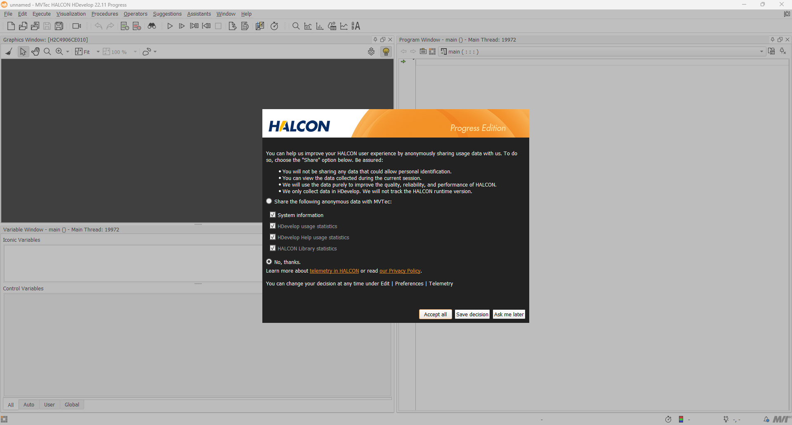

# Halcon 软件安装

这里选择安装的版本是 `Halcon22.11-Progress` Windows离线安装版本 `halcon-22.11.0.0-x64-win64`.

安装步骤如下：

- 运行 `som.exe` 在浏览器窗口 `http://localhost:8188` 打开网页安装管理界面
- 不要点击 `INSTALL SOM 1.2.1.167` 按钮，直接关闭 Welcome 界面
- 点击 Available 选项卡，看到可以安装的 Halcon 选项，这里根据需要选择 `INSTALL FOR ALL USERS`
- 在 Package selection 里面选择 All 全部安装，然后取消勾选 Variable Inspect Extension for Visiual Studio，以后用到的时候再安装。点击 Apply for All Users 开始安装。
- 安装完成之后将试用版的 License 文件（我这里使用的是`license_eval_halcon_progress_2024_09.dat`）放到 `C:\Program Files\MVTec\HALCON-22.11-Progress\license` 文件夹下（试用期为一个月）
- 点击 Launch 启动 HDevelop，出现如下界面说明安装成功。

